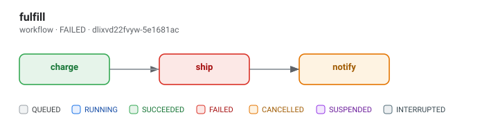

# quacker 🦆

An **embeddable task & workflow orchestration engine** for Go — a single-process
alternative to [Hatchet](https://github.com/hatchet-dev/hatchet). No server, no
Postgres, no workers to deploy: state lives in SQLite (in-memory by default),
tasks are plain Go functions, and **execution state is readable at any moment
without pausing execution**.

```go
q, _ := quacker.Open() // ephemeral in-memory state

charge := quacker.NewTask("orders.charge", func(ctx context.Context, o Order) (Receipt, error) {
    return chargeCard(ctx, o)
})

h, _ := quacker.Enqueue(ctx, q, charge, Order{ID: "o-1"})
receipt, _ := h.Result(ctx)

// Any time, from anywhere in your process:
snap, _ := q.Execution(ctx, h.RunID()) // status, attempts, step DAG, timings
events, stop := q.Subscribe(h.RunID()) // live transition stream
```

## Why quacker

| | Hatchet | quacker |
|---|---|---|
| Deployment | Server + Postgres (+ Docker) | One `go get`, embedded in your binary |
| State | Postgres | SQLite (pure Go driver, no CGo) |
| Introspection | Web UI / API over HTTP | In-process snapshots & streams, zero network |
| Scope | Distributed fleet | One process, all cores |

Use quacker when your app *is* the worker: background jobs, pipelines, agent
orchestration, fan-out/fan-in — anything where "spin up a queueing platform"
is the wrong amount of infrastructure.

## Features

- **Typed tasks** — `NewTask[I, O]` with JSON-serialized payloads
- **Retries** — attempt counts, exponential/constant backoff with jitter
- **Timeouts** — per-attempt, via `context`
- **Queues** — named queues with independent concurrency limits and priorities
- **Per-key concurrency** — `WithKey` serializes (or caps at N) runs sharing
  a key, enforced by counting RUNNING rows at claim time
- **Rate limiting** — `WithRate(queue, n, per)` caps starts per sliding
  window; the window is persisted, so it survives File-mode restarts
- **Middleware** — `quacker.Use` / `Wrap` decorators around task execution
  for timing, tracing, error taxonomies, and custom metrics
- **Bring-your-own logs** — task logs flow to a sink you choose (engine slog
  by default); opt into SQLite persistence with `WithLogStorage(true)`
- **Retention / purge** — `q.Purge` and `WithRetention` bound a long-lived
  process's growth in every storage mode
- **Metrics callback** — `WithMetricsFunc` pushes periodic state snapshots
- **DAG workflows** — steps with dependencies, upstream outputs via `DepOutput`
- **DAG visualization** — `q.DAGJSON` / `q.DAGSVG` render a run's step graph
  with the current state of every node
- **Child runs** — `quacker.EnqueueChild` from inside a task records lineage;
  `Execution` exposes a run's children
- **Cron & delayed runs** — cron specs (`"@daily"`, `"0 9 * * 1-5"`), sub-second
  `"@every 250ms"`, and `quacker.WithDelay`; crons persist and re-arm on
  restart
- **In-process events** — `q.Emit(name, payload)` fans out to tasks bound with
  `quacker.On(name, task)`, each receiving the payload as input
- **Durable execution** — `quacker.SleepDurable` and
  `quacker.WaitFor` suspend a run without holding a worker slot and survive
  restarts; `quacker.RunOnce` keeps side effects from repeating when a task
  replays
- **Cancellation** — instant, propagated to running task contexts
- **Non-blocking introspection** — `Execution`, `Runs`, `Metrics`, `DAGJSON`,
  `Logs`, `Subscribe` — never pause or slow the workers
- **Debug log stream** — `q.DebugLogs()` yields engine activity (claims,
  retries, suspensions, completions) in-process, without serving HTTP
- **Graceful shutdown** — drains in-flight work, marks stragglers, optional
  recovery on restart (File storage)

## Storage modes

```go
quacker.Open(quacker.WithStorage(quacker.Memory()))    // pure :memory: SQLite
quacker.Open(quacker.WithStorage(quacker.Ephemeral())) // default; temp file, WAL, deleted on Close
quacker.Open(quacker.WithStorage(quacker.File("state.db").RecoverRunningOnBoot(true)))
```

- **`Memory`** — nothing touches the filesystem. Note: SQLite `:memory:`
  databases cannot use WAL, so reads can briefly wait on an in-flight write
  (absorbed by `busy_timeout`).
- **`Ephemeral`** (default) — WAL-backed temp file with `synchronous=OFF`,
  deleted on `Close`. Same zero-durability semantics as memory, but readers
  are truly lock-free versus the write path.
- **`File`** — survives restarts. Runs interrupted by a previous process are
  re-queued on boot (or marked failed with `RecoverRunningOnBoot(false)`).
  Opening a `File` path takes an exclusive kernel advisory lock
  (`flock`/`LockFileEx`) on a `<path>.quacker.lock` sidecar file, so a
  second engine on the same path fails fast — and the lock is released
  automatically when the process dies, even on SIGKILL. On platforms
  without kernel advisory locks (`!unix && !windows`), only same-process
  exclusion holds.

WAL modes (`Ephemeral`, `File`) run a passive `wal_checkpoint` every 60s
(`WithCheckpointInterval`) and a truncating checkpoint on `Close`, so a
clean shutdown leaves the `-wal` file empty (usually deleted).

How non-blocking introspection works: the store keeps a **single writer
connection** and a **separate read-only pool**. In WAL mode readers never
block the writer, so `Execution()`/`Metrics()` can run in the middle of a
thousand concurrent task transitions without adding contention. A push-based
event bus (`Subscribe`) covers hot-path observation without touching SQLite
at all; snapshots remain the authoritative view.

## Workflows (DAGs)

```go
ship := quacker.NewTask("ship", func(ctx context.Context, o Order) (Shipment, error) {
    rec, err := quacker.DepOutput[Receipt](ctx, "charge") // upstream output
    ...
})

wf := quacker.NewWorkflow[Order]("fulfill",
    quacker.Step("charge", charge),
    quacker.Step("ship", ship, "charge"),  // after charge
    quacker.Step("notify", notify, "ship"), // after ship — and therefore charge
)

h, _ := quacker.EnqueueWorkflow[Shipment](ctx, q, wf, order) // Result = last step's output
```

Steps start the moment their dependencies succeed. If a step exhausts its
retries, the run fails and remaining steps are cancelled. Task logs written
inside steps go to your configured log sink (see [Task logs](#task-logs)).

**Dependencies are direct requirements.** Ordering is transitive — a step
named as a dep of `ship` is already ordered before anything `ship` precedes —
so you only list `"charge"` on `notify` if you want the edge explicit or
robust to `ship`'s definition changing. There is one hard reason to list it:
`DepOutput` sees only *declared* deps, so a step must name a dep to read its
output (see `ship` reading `charge` above).

## DAG visualization

Inspect a run's step graph — with the **current state** of every node — as
JSON or as a self-contained SVG (no Graphviz, no browser needed):

```go
js, _ := q.DAGJSON(ctx, runID) // nodes, edges, statuses, attempts, errors
svg, _ := q.DAGSVG(ctx, runID) // status-coloured boxes in dependency order
os.WriteFile("dag.svg", svg, 0o644)

d, _ := q.DAG(ctx, runID) // the structured model, if you prefer
```

Nodes are laid out in dependency levels (left to right) and coloured by
status. Here is a workflow mid-failure — `charge` succeeded, `ship` failed,
`notify` was cancelled:



`DAGJSON` marshals to JSON for persistence or an HTTP endpoint; `DAGSVG`
returns a standalone document you can write to a file or serve inline.

## Concurrency & rate control

```go
// At most one run per customer at a time, across every queue:
charge := quacker.NewTask("orders.charge", fn,
    quacker.WithKey(func(o Order) string { return o.CustomerID }),
    // quacker.WithKeyConcurrency(3), // default 1 = strict per-key serialization
)

// At most 50 starts per minute on the "emails" queue — a sliding window
// counted over persisted claim times, so it survives File-mode restarts:
q, _ := quacker.Open(
    quacker.WithRate("emails", 50, time.Minute),
)
q.SetRateLimit("emails", 100, time.Minute) // adjustable at runtime
```

A due step whose key is saturated — or whose queue's window is full — stays
`QUEUED` until a slot opens; nothing is rejected or dropped. Keys are visible
in `Execution` snapshots (`Key` on the run and each step).

## Middleware

```go
// Engine-wide: the first registered is the outermost.
q.Use(func(next quacker.Handler) quacker.Handler {
    return func(ctx context.Context, in json.RawMessage) (json.RawMessage, error) {
        start := time.Now()
        out, err := next(ctx, in)
        observe(quacker.RunIDFromContext(ctx), time.Since(start), err)
        return out, err
    }
})

// Or per task:
task := quacker.NewTask("charge", fn, quacker.Wrap(myTracingMW))
```

Middleware runs once per attempt, so timing and retry observability are
accurate. Order is global → per-task → body; a middleware may short-circuit
by returning without calling `next`. Panics are recovered exactly like a task
panic. `StepFromContext` exposes `RunID`, `Step`, `Task`, and `Attempt`.

## Task logs

Task logs are **not stored by the engine by default**. `TaskLogger(ctx)`
writes each line to a sink you choose: the engine logger by default, or
whatever you pass to `WithTaskLogSink` (and/or redirect per step with
`WithLogSink` inside middleware). This keeps a long-lived daemon from growing
logs it never reads.

```go
q, _ := quacker.Open(
    // Send lines anywhere — file, ring buffer, external collector:
    quacker.WithTaskLogSink(func(e quacker.LogEntry) { myStore.Add(e) }),
)

// Or opt back into built-in SQLite persistence + q.Logs:
q, _ := quacker.Open(quacker.WithLogStorage(true))
```

Sinks run synchronously in the task's goroutine, so keep them fast (buffer or
hand off if the destination can block). Built-in storage writes through the
same batched path as before (~50ms batches, dropped on overflow rather than
slowing your task) and is read back with `q.Logs`.

```go
task := quacker.NewTask("import", func(ctx context.Context, in Input) (Output, error) {
    log := quacker.TaskLogger(ctx)
    log.Info("starting batch", "size", len(in.Rows))
    ...
})
```

## Retention & purge

```go
res, err := q.Purge(ctx, quacker.PurgeOptions{
    OlderThan: 24 * time.Hour,        // terminal runs finished before this
    // Statuses: []quacker.Status{quacker.StatusSucceeded}, // default: all terminal
    // KeepLogs: true,                // default false: delete logs with the run
})
// res.Runs, res.Steps, res.Logs

// Or let the engine do it on a schedule:
q, _ := quacker.Open(quacker.WithRetention(quacker.RetentionPolicy{
    OlderThan: 24 * time.Hour,
    Interval:  time.Hour,
}))
```

Purging is storage-agnostic and bounds growth in every mode, including
`Memory` (which otherwise grows RAM for the process's lifetime) and
`Ephemeral`. Only terminal runs are ever eligible, and never while any of
their steps is still `RUNNING` — so a purge cannot race a step recording its
own cancellation. When logs are purged, an orphan sweep removes logs whose run
no longer exists.

## Cron & events

```go
// Standard specs, descriptors, and sub-second @every:
err := quacker.Cron(q, "nightly", "@every 250ms", report, Report{Day: "yesterday"})

// Event bindings: on emit, each bound task runs with the payload as input.
err = quacker.On(q, "order.placed", receipt)
err = quacker.On(q, "order.placed", notify)
n, err := q.Emit(ctx, "order.placed", OrderPlaced{ID: "o-1", Total: 4200})
events, _ := q.Events(ctx, 100) // newest-first persisted emit audit
```

With File storage, crons and event bindings persist: on the next `Open` they
are loaded and arm as soon as their task is registered, so the app only needs
`quacker.Register`. A stored fire time still in the future is honored; a
missed one is recomputed from now (no catch-up burst).

## Child runs

```go
parent := quacker.NewTask("import", func(ctx context.Context, batch Batch) (Summary, error) {
    for _, row := range batch.Rows {
        // Recorded as a child of this run; runs independently.
        if _, err := quacker.EnqueueChild(ctx, q, processRow, row); err != nil {
            return Summary{}, err
        }
    }
    return Summary{Queued: len(batch.Rows)}, nil
})

snap, _ := q.Execution(ctx, parentRunID) // snap.Children lists them
```

Children are ordinary runs with `ParentID` set. There is no implicit join —
the parent can finish while its children run — and a failed child does not
fail the parent. `RunFilter{ParentID: ...}` lists a run's children, and
lineage is informational: purging a parent leaves its children (with a
dangling `ParentID`) intact.

A child enqueued **before** a durable await re-enqueues on replay (the task
re-runs from the top), so wrap it in `RunOnce` when the task also uses
`SleepDurable`/`WaitFor`:

```go
childID, err := quacker.RunOnce(ctx, "spawn-children", func() ([]string, error) {
    // enqueue once, return the ids for later
})
```

## Durable execution

```go
task := quacker.NewTask("orders.fulfill", func(ctx context.Context, id string) (string, error) {
    // Runs exactly once, even though the task replays after the sleep below.
    receipt, err := quacker.RunOnce(ctx, "reserve", func() (string, error) {
        return reserve(id) // a side effect you don't want to repeat
    })
    if err != nil {
        return "", err
    }

    if err := quacker.SleepDurable(ctx, 2*time.Hour); err != nil { // no worker slot held
        return "", err
    }

    // Suspend until an event arrives (or time out). Wait is durable and
    // subscription-style: only events emitted after it registers count.
    var payment Payment
    payment, err = quacker.WaitFor[Payment](ctx, "payment.received", 24*time.Hour)
    if err != nil {
        return "", err // quacker.ErrWaitTimeout on timeout
    }
    return ship(receipt, payment), nil
})
```

`q.Emit(ctx, "payment.received", payment)` wakes every waiting run with the
payload in one transaction; it also still triggers `On`-bound tasks.

`SleepDurable` and `WaitFor` mark the step `SUSPENDED`: they release the
queue and per-key slots and are not charged an attempt. When a sleep's wake
time passes — or the awaited event is emitted — the step is claimed again and
the task is re-invoked **from the top**, at which point the await returns
immediately. With File storage this survives a restart; the per-attempt
timeout covers active execution only, not suspended time.
`Execution().Steps[i].Status` shows `SUSPENDED` with `WaitEvent`/`ResumeAt`.
Delivery is durable: `Emit` records the event and wakes every waiter in one
transaction, and a wait that has timed out is never resurrected by a later
emit.

Two rules make this safe:

- **Code before a durable await re-executes on resume.** Wrap side effects in
  `RunOnce(key, fn)` — its result is memoized, so it runs once on success and
  re-runs on failure (idempotency stays with you on the failure path).
- **Do not `recover()` around a durable helper**, in a task or in middleware —
  suspension unwinds via an internal panic, and recovering swallows it.

Replay is validated: if a task's durable calls no longer match its persisted
journal (e.g. you deployed changed code while runs were suspended), the step
fails with `quacker.ErrJournalMisaligned` rather than resuming with wrong data.

## Cancellation & shutdown

```go
q.Cancel(h.RunID())        // queued steps → CANCELLED, running contexts cancelled
// Result returns quacker.ErrRunCancelled

q.Close(ctx)               // stop claiming, drain in-flight (30s default deadline),
// Result returns quacker.ErrRunInterrupted if the deadline expires
```

## Observability

```go
snap, _ := q.Execution(ctx, h.RunID())          // full snapshot (JSON-tagged)
runs, _ := q.Runs(ctx, quacker.RunFilter{Status: quacker.StatusRunning})
m, _ := q.Metrics(ctx)                          // counts by status, queue depths
dag, _ := q.DAGJSON(ctx, h.RunID())             // step graph + current state
logs, _ := q.Logs(ctx, h.RunID(), 100)          // needs WithLogStorage(true)
events, stop := q.Subscribe("")                 // "" = all runs
```

`q.Logs` returns nothing unless built-in storage is enabled. For a
turnkey push, `quacker.WithMetricsFunc(fn)` (with `WithMetricsInterval`)
invokes `fn(*Metrics)` on an interval — a one-liner for Prometheus until OTel
lands. All snapshot types marshal to JSON, so exposing them over HTTP is
trivial.

## Debug logging

The engine streams its own activity — claims, retries, suspensions, run
completions, plus anything you log through `q.DebugLogger()` — so you can
observe it without the engine serving HTTP:

```go
go func() {
    for rec := range q.DebugLogs() {
        log.Printf("%s %s %v", rec.Level, rec.Message, rec.Attrs)
    }
}()

q.DebugLogger().Info("checkpoint reached", "batch", 7) // joins the same stream
```

The stream is bounded and drops records when the consumer falls behind — it
never blocks the engine or grows unbounded — and it closes on `Close`, ending
the range. For a lossless-per-subscriber status stream use `Subscribe`.

## Notes & semantics

- **Task names are part of the storage format.** Renaming a task orphans its
  in-flight runs.
- **Re-registering a task name replaces its function.** `Enqueue`,
  `Register`, `Cron`, and `On` all overwrite the registered def for that name;
  in-flight runs execute the currently registered def at claim time.
- **Crons and event bindings persist.** With File storage they are loaded on
  `Open` and arm automatically the moment their target task is registered —
  so a restarted app only needs `quacker.Register`, not a re-`Cron`/re-`On`.
  A stored fire time still in the future is kept; a missed one is skipped
  (no catch-up burst). Unregistered targets simply stay pending.
- **Events are best-effort and in-process.** `Emit` records the event and
  atomically wakes every durable `WaitFor` on it; the `On`-binding fan-out
  (enqueueing a run per bound task) is best-effort, so a crash between the two
  can lose those enqueues. Event *waits* are durable and at-least-once.
- Tasks should honor `ctx` — timeouts and cancellation are cooperative.
- One engine per process assumes a single writer to a given `File` path —
  enforced by the `.quacker.lock` kernel-lock guard: a second engine on
  the same path fails fast at `Open` instead of corrupting assumptions.

## Not yet

Distributed workers across processes (the Postgres/multi-instance epic),
strict (ordered) per-key concurrency, worker labels/affinity, a web UI, and
OpenTelemetry.

## Documentation

- [Architecture](docs/ARCHITECTURE.md) — how the engine, store, and event bus fit together
- [Design notes](docs/DESIGN_NOTES.md) — key decisions and lessons from the build
- [Benchmarks](docs/BENCHMARKS.md) — numbers, methodology, how to reproduce
- [Roadmap](docs/ROADMAP.md) — shipped versions, v0.3 visibility/perf, follow-on epics

## Examples

 runnable programs live in [`examples/`](examples/):
[`simple`](examples/simple/main.go) · [`dag`](examples/dag/main.go) ·
[`dagsvg`](examples/dagsvg/main.go) · [`cron`](examples/cron/main.go) ·
[`events`](examples/events/main.go) · [`durable`](examples/durable/main.go) ·
[`children`](examples/children/main.go) ·
[`introspect`](examples/introspect/main.go)

## Development

```sh
go test ./...          # unit + integration suite
go test -race ./...    # includes an introspection-under-load stress test
go vet ./... && gofmt -l .
```
